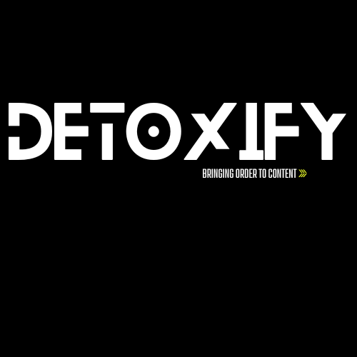

# Detoxify

> Smart Content. Clear Categories.

Detoxify is an AI-powered content classification system that helps identify and categorize YouTube content using state-of-the-art BERT models. Built with accuracy and scalability in mind, it currently classifies content into chess, coding, mathematics, and other categories.

## 🚀 Features

- **Intelligent Classification**: Powered by fine-tuned BERT models
- **High Accuracy**: Achieves 87.8% accuracy on test data
- **REST API**: Easy-to-use FastAPI endpoints
- **Token-based Authentication**: Secure API access
- **Real-time Processing**: Quick classification response
- **Scalable Architecture**: Built for high-volume processing

## 📊 Performance Metrics

- Accuracy: 87.8%
- ROC-AUC Scores:
  - Chess: 0.976
  - Coding: 0.971
  - Mathematics: 0.949
  - Other: 0.941

## 🧪 Model Training

The model was trained on a curated dataset of YouTube content with:
- 10 epochs
- Learning rate: 2e-5
- Batch size: 16
- BERT base architecture

## 📦 Dependencies

- Python 3.8+
- FastAPI
- PyTorch
- Transformers
- Pandas
- NumPy

## 🤝 Contributing

Contributions are welcome! Please feel free to submit a Pull Request. For major changes, please open an issue first to discuss what you would like to change.

1. Fork the repository
2. Create your feature branch (`git checkout -b feature/AmazingFeature`)
3. Commit your changes (`git commit -m 'Add some AmazingFeature'`)
4. Push to the branch (`git push origin feature/AmazingFeature`)
5. Open a Pull Request

## 📝 License

This project is licensed under the MIT License - see the [LICENSE](LICENSE) file for details.

## 🙏 Acknowledgments

- BrightData API for the scraping youtube content
- FastAPI team for the excellent web framework

## 📧 Contact

Your Name - [@curlydazai](https://x.com/curlydazai) - saarthaksaxena7@gmail.com

Project Link: [https://github.com/Saarthakkj/detoxify_yt](https://github.com/Saarthakkj/detoxify_yt)

---

Made with ❤️ for making your youtube feed better

