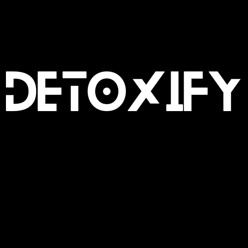

# Detoxify



> Smart Content. Clear Categories. Better YouTube Feed.

Detoxify is an AI-powered Chrome extension and content classification system that declutters your YouTube feed by intelligently categorizing videos into Chess, Coding, Mathematics, and other categories using state-of-the-art BERT models.

## 🚀 Quick Start

### Local Setup

1. **Clone the Repository**
```bash
git clone https://github.com/Saarthakkj/detoxify_yt.git
cd detoxify_yt
```

2. **Install Dependencies**
```bash
npm install
```

3. **Run Backend Locally**
```bash
cd backend
uvicorn main:app --host 0.0.0.0 --port 8000
```

4. **Configure Extension for Local Development**
- Open `extension/background.js`
- Replace the API URL:
```javascript
// Change this line
fetch("https://detoxify-yt.onrender.com/predict", {
// To this
fetch("http://localhost:8000/predict", {
```

5. **Load Extension in Chrome**
- Open Chrome and navigate to `chrome://extensions/`
- Enable "Developer mode" (top right)
- Click "Load unpacked"
- Select the `extension` folder from the cloned repository

### Why Run Locally?
- Faster response times compared to hosted backend

Note: The local backend will provide significantly faster classification compared to the hosted version on Render.

## 🎯 Overview

Detoxify is a complete ecosystem that combines:
- Chrome Extension for user interaction
- FastAPI backend for processing
- BERT model for classification
- BrightData API for dataset generation

## 🏗️ System Architecture

### 1. Chrome Extension (Frontend)
- Real-time content scraping initiation
- Dynamic video filtering based on classifications

### 2. FastAPI Backend
- High-performance API endpoints
- Asynchronous processing
- Token-based authentication
- Real-time data handling

### 3. BERT Classification Model
- Fine-tuned on YouTube content
- Multi-category classification
- Real-time inference capabilities

### 4. BrightData Scraping API
- Efficient data collection
- High Quality Dataset-generation

## 🚀 Features

- **Intelligent Classification**: BERT-powered content categorization
- **High Accuracy**: 87.8% classification accuracy
- **Processing**: Content filtering
- **Three Categories**: Chess, Coding, Mathematics

## 📊 Performance Metrics

### Model Performance
- Overall Accuracy: 87.8%

### ROC-AUC Scores
- Chess: 0.976
- Coding: 0.971
- Mathematics: 0.949
- Other: 0.941

## 🛠️ Technical Implementation

### Model Training Configuration
```python
training_args = TrainingArguments(
    learning_rate=2e-5,
    per_device_train_batch_size=16,
    num_train_epochs=10,
    warmup_ratio=0.1,
    weight_decay=0.01
)
```

### System Requirements
- Python 3.8+
- Chrome Browser (latest version)
- Internet connection for API access

### Core Dependencies
```
fastapi==0.104.1
uvicorn==0.23.2
pydantic>=2.0.0
transformers>=4.30.0
torch>=2.0.0
python-dotenv==1.0.1
requests>=2.31.0
```

## 🔄 Workflow

1. **User Interaction**
   - Install Chrome extension
   - Select content category

2. **Data Processing**
   - Backend processes incoming data
   - BERT model classifies content

3. **Content Filtering**
   - Relevant videos are displayed
   - Non-matching content is hidden

## 🔒 Security

- Token-based API authentication
- Secure data transmission
- Protected model endpoints

## 🔮 Future Enhancements

- Implementing faster models
- Better UI/UX for extension
- Additional content categories

## 🤝 Contributing

1. Fork the repository
2. Create feature branch (`git checkout -b feature/Enhancement`)
3. Commit changes (`git commit -m 'Add Enhancement'`)
4. Push to branch (`git push origin feature/Enhancement`)
5. Open Pull Request

## 📝 License

This project is licensed under the MIT License - see [LICENSE](LICENSE) file.

## 🙏 Acknowledgments

- BrightData API for YouTube content scraping
- FastAPI team for the web framework
- Hugging Face for transformer models
- Render for deploying

## 📧 Contact

Prakhar Agrawal 
- Email: prakhar20585@gmail.com

Saarthak Saxena
- Twitter: [@curlydazai](https://x.com/curlydazai)
- Email: saarthaksaxena7@gmail.com

Project: [GitHub Repository](https://github.com/Saarthakkj/detoxify_yt)

---
<p align="center">Made with ❤️ for a cleaner YouTube experience</p>